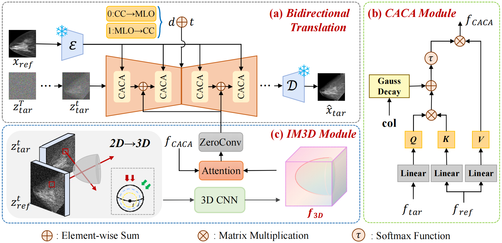
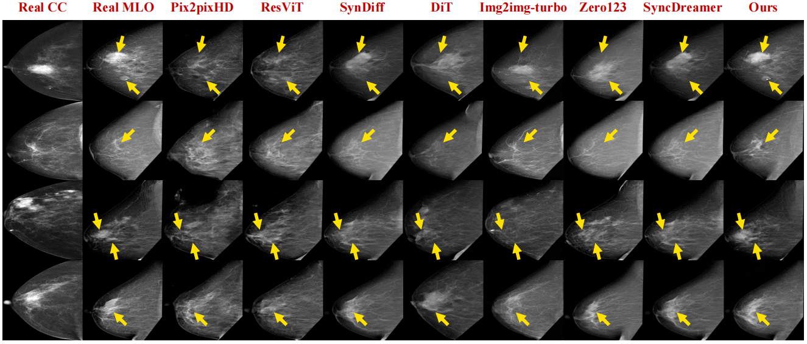
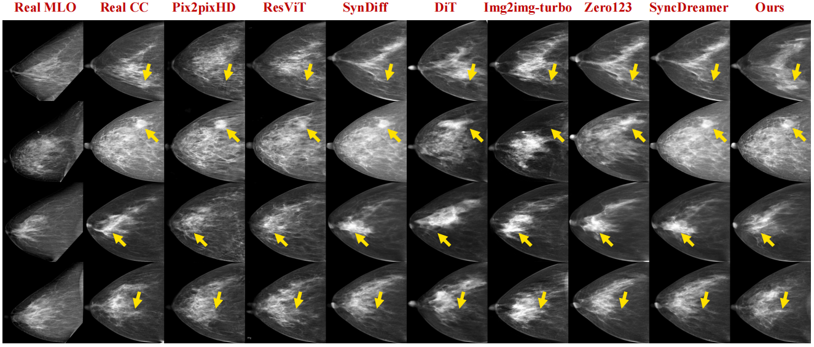

# Official PyTorch Implementation of CA3D-Diff
### BIBM 2025

This repository provides the official PyTorch implementation of Column-Aware and Implicit 3D Diffusion (CA3D-Diff), a novel framework for bidirectional mammogram view translation. Our method enables the synthesis of one standard mammographic view (e.g., MLO) from another (e.g., CC), or vice versa, facilitating cross-view analysis. For technical details, please refer to:

Bidirectional Mammogram View Translation with Column-Aware and Implicit 3D Conditional Diffusion. 

Overall Framework of the proposed CA3D-Diff:
<p align="center">
  
</p>


## Usage

### Conda
We train our model on a single A100 80GB GPU with 33GB. Inference can conduct on RTX4090 with 4GB.
```
conda env create -f environment.yml
conda activate CA3D-Diff
```
### Dataset
Please divide paired CC view and MLO view images by train, val, and test. The matched image filenames are almost identical, differing only in their suffixes: "CC.png" and "MLO.png". For example:

``` 
DATA_FOLDER
├── CC
│   ├── train
│   ├── val
│   └── test
└── MLO
    ├── train
    ├── val
    └── test
```

### Training
Download image-conditioned stable diffusion checkpoint:  
`wget https://cv.cs.columbia.edu/zero123/assets/sd-image-conditioned-v2.ckpt`

```
source train.sh
```
config file is in 'configs/train.yaml', you can modify the parameters in the file.
### Inference
```
source inference.sh
```
### evaluation

```
python evaluation.py
```

## Results

Visual results on the VinDr-Mammo dataset. We compare our CA3D-Diff with several SOTA methods for both directions.

CC——>MLO
<p align="center">
  
</p>
MLO——>CC
<p align="center">
  
</p>


## Acknowledgement
Our implementation extensively builds upon code from the following repositories. We gratefully acknowledge the original authors for their open-source contributions.

- [SyncDreamer](https://github.com/liuyuan-pal/SyncDreamer)
- [zero123](https://github.com/cvlab-columbia/zero123)


